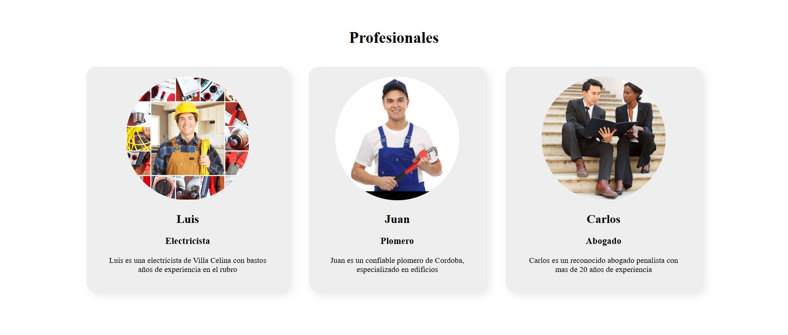

# Tarea nro. 4: React inicial

El siguiente proyecto presenta una pagina de presentacion para los 
empleados de una compañia. 

# Instrucciones para instalar/ejecutar

- npm install
- npm run dev

# Autor 

- Luciano Buceta (Github: LucianoB01)
- Curso de desarrollo de React JS
- Tarea nro. 4 - Unidad 4 

# Fuentes utilizadas

- 